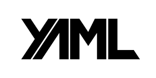

# YAML Y JSON 

## **YAML**



YAML és un format de serialització de dades llegible per humans inspirat en llenguatges com XML, C, Python, Perl, així
com en el format dels correus electrònics (RFC 2822) . YAML va ser proposat per Clark Evans en 2001, qui ho va
dissenyar al costat de Ingy döt Net i Oren Ben-Kiki.

### **Exemple de sintaxi de YAML**

Aquest és un exemple d'un arxiu YAML senzill per al registre d'un estudiant que demostra les regles de sintaxis:

```
#Comentario: registro de estudiante #Describe algunas características y preferencias --- nombre: Martin D'vloper #clave-valor edad: 26 pasatiempos: - pintar #primer elemento de la lista - tocar_instrumentos #segundo elemento de la lista - cocinar #tercer elemento de la lista lenguajes_de_programación: java: intermedio python: avanzado javascript: principiante comidas_preferidas: - vegetales: tomates - frutas: cítricos: naranjas tropicales: bananas nueces: maní dulce: pasas
```

### **Característiques**

* Els continguts en YAML es descriuen utilitzant el conjunt de caràcters imprimibles de Unicode, bé en UTF-8 o
UTF-16.
* L'estructura del document es denota indentando amb espais en blanc; no obstant això no es permet l'ús de caràcters
de tabulació per a sagnar.
* Els membres de les llistes es denoten encapçalats per un guió ( - ) amb un membre per cada línia, o bé entre
claudàtors ([ ]) i separats per coma espai ( , ).
* Els valors senzills (o escalars) en general apareixen sense *entrecomillar, però poden incloure's entre cometes
dobles (") , o cometes simples (').
* En les cometes dobles, els caràcters especials es poden representar amb seqüències de fuita similars a les del
llenguatge de programació C, que comencen amb una barra invertida (\)
* Es poden incloure múltiples documents dins d'un únic flux, separant-los per tres guions (---) ; els tres punts (...)
indiquen la fi d'un document dins d'un flux.

YAML requereix que les comes i punts i comes que s'utilitzen com a separadors en les llistes siguen seguits per un
espai, de manera que els valors escalars que continguen signes de puntuació es puguen representar sense necessitat
d'utilitzar cometes.

### Llistes

```
--- # Películas favoritas, formato de bloque
 - BotijoAzul
 - BotijoVerde
 - Viridiana
 - Psicosis
 ...
 --- # Lista de la compra, formato en línea
 [leche, pan, huevos]
 [chorizo, morcilla, botijo, pollo]
```
### Vectors asociats

```
--- # Bloque
 nombre: Pepe López
 edad: 33
 --- # En  línea
 {nombre: Pepe López, edad: 33}
```

## **JSON**


JSON (acrònim de JavaScript Object Notation, 'notació d'objecte de JavaScript') és un format de text senzill per a
l'intercanvi de dades. Es tracta d'un subconjunt de la notació literal d'objectes de JavaScript, encara que, a causa
de la seua àmplia adopció com a alternativa a XML, es considera un format independent del llenguatge.

Una dels suposats avantatges de JSON sobre XML com a format d'intercanvi de dades és que resulta molt més senzill
escriure un analitzador sintàctic (parser) per a ell.1 En JavaScript, un text JSON es pot analitzar fàcilment usant
la funció eval () , alguna cosa que (a causa de la ubiqüitat de JavaScript en quasi qualsevol navegador web) ha sigut
fonamental perquè haja sigut acceptat per part de la comunitat de desenvolupadors AJAX.

### Comparació amb XML i altres llenguatges de marcat

Hi ha molts analitzadors JSON en el costat del servidor, existint almenys un analitzador per a la majoria dels
entorns. En alguns llenguatges, com Java o PHP, hi ha diferents implementacions on triar. En JavaScript, l'anàlisi és
possible de manera nativa amb la funció JSON.parse () . Tots dos formats manquen d'un mecanisme per a representar
grans objectes binaris.

És una possible representació JSON del següent XML:14

```
<menu id="file" value="File">
    <popup>
      <menuitem value="New" onclick="CreateNewDoc()" />
      <menuitem value="Open" onclick="OpenDoc()" />
      <menuitem value="Close" onclick="CloseDoc()" />
    </popup>
  </menu>

```

### Avantatges

* És autodescriptiu i fàcil d'entendre.
* La seua senzillesa li ha permés posicionar-se com la millor alternativa a XML.
* És més ràpid en qualsevol altre navegador.
* És de fàcil lectura.
* És més lleuger (en bytes) en les transmissions.
* S'analitza més ràpid.
* Té una velocitat de processament alta.
* Pot ser entés de manera nativa pels analitzadors de JavaScript.

### Desavantatges

* Alguns desenvolupadors troben la seua bàsica notació una mica confusa.
* No compta amb extensibilitat.
* No suporta grans càrregues, sol dades comunes.
* Requereix de mecanismes externs, com a expressions regulars, per a la seguretat.

## **BIBLIOGRAFIA**

* https://es.wikipedia.org/wiki/YAML
* https://es.wikipedia.org/wiki/JSON
* https://www.redhat.com/es/topics/automation/what-is-yaml
* 
